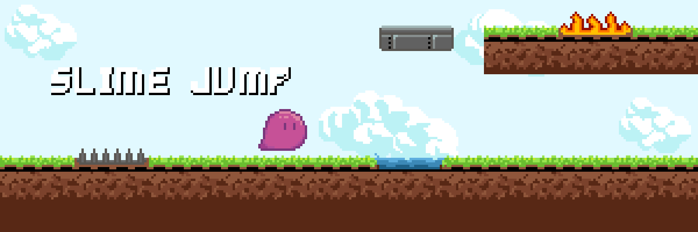

### Hi there 👋

Hi, I'am Juni. a game programmer and sometime a solo game developer. i use Godot Game engine as my primary tools to make a game. 

### Tools i used 🔧
#### Engine

#### Programming Languages

### Lastest Game Project 🎮

### How to reach me 💬

